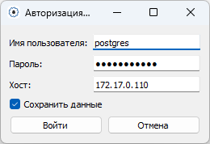
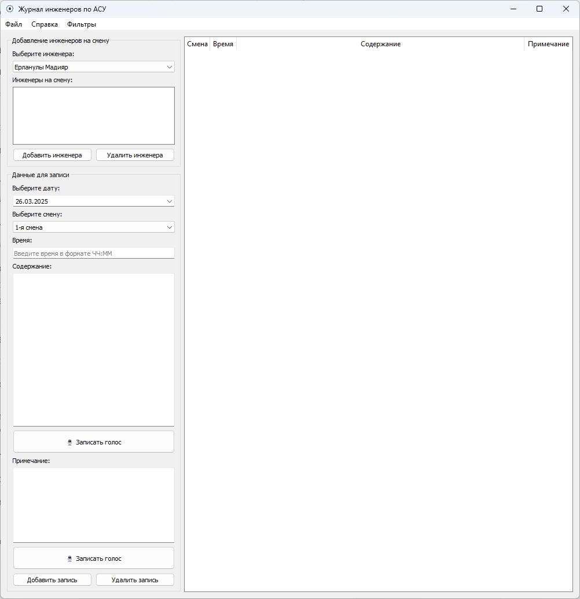
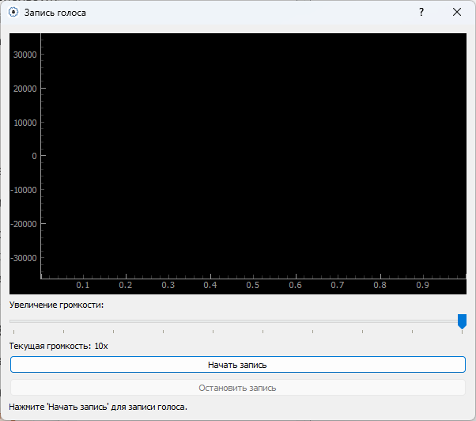
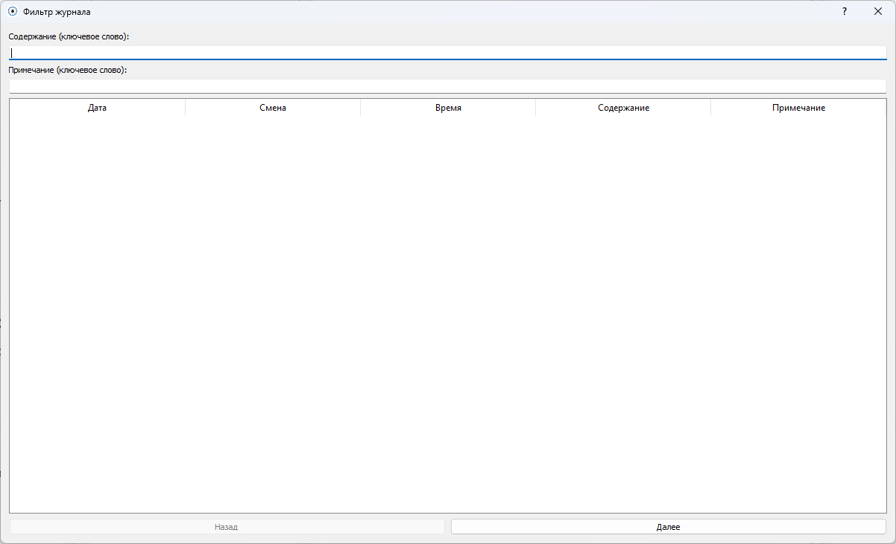

# Журнал инженеров по АСУ:

Это десктопное приложение, разработанное на Python с использованием PyQt5, предназначенное для ведения журнала смен инженеров в автоматизированных системах управления (АСУ). Программа интегрируется с базой данных PostgreSQL для хранения данных, поддерживает голосовой ввод, экспорт отчетов в Word и отправку по email через Outlook.

## Скриншоты:
### Окно авторизации:
<div style="text-align: center;">
    
    <p>Ввод учетных данных для подключения к базе данных PostgreSQL.</p>
</div>

### Главное окно:
<div style="text-align: center;">
    
    <p>Интерфейс для управления журналом, добавления инженеров и записей.</p>
</div>

### Запись голоса:
<div style="text-align: center;">
    
    <p>Окно для записи голоса с визуализацией аудиосигнала и преобразованием в текст.</p>
</div>

### Окно фильтров:
<div style="text-align: center;">
    
    <p>Интерфейс для фильтрации записей журнала по содержанию и примечаниям.</p>
</div>

## Требования для запуска
- Установленный Python 3.8+.
- База данных PostgreSQL с созданной схемой shift_journal_db.
- Установленные зависимости (см. ниже).
- Настроенный микрофон для голосового ввода.
- Microsoft Outlook для отправки писем (опционально).
- Файл ресурсов resources.py (сгенерированный через pyrcc5 из .qrc, если используются иконки).

## Основные функции:
- Авторизация и управление записями в журнале.
- Добавление инженеров на смену.
- Голосовой ввод с визуализацией.
- Экспорт в Word и отправка через Outlook.
- Фильтрация записей.

## Используемые библиотеки:
- `psycopg2` — подключение к PostgreSQL.
- `PyQt5` — графический интерфейс.
- `python-docx` — создание Word-документов.
- `pywin32` — интеграция с Outlook.
- `speech_recognition` — распознавание речи.
- `pyaudio` — запись звука с микрофона.
- `pyqtgraph` — визуализация аудиосигнала.
- `numpy` — обработка аудиоданных.
- `configparser` — работа с конфигурационными файлами.
- `logging` — логирование событий (встроенная библиотека Python, установка не требуется).
- `os`, `sys` — работа с системой (встроенные библиотеки, установка не требуется).

## Установка
1. **Установите PostgreSQL**:  
   - Скачайте и установите PostgreSQL с официального сайта (https://www.postgresql.org/download/).  
   - Создайте базу данных с именем `shift_journal_db`, куда будут вставляться записи журнала и инженеров.  
   - Настройте пользователя и пароль для доступа (например, через `pgAdmin` или командную строку).  
2. **Установите Python 3.8+**: Скачайте с python.org, если ещё не установлено.
   
## Установите зависимости:

Вы можете установить все необходимые библиотеки одной командой:

```bash
pip install psycopg2-binary PyQt5 python-docx pywin32 speechrecognition pyaudio pyqtgraph numpy configparser
```

Или установить их по отдельности, скопировав команды из файла `requirements_install.sh`:

```bash
bash requirements_install.sh
```

Создайте файл `requirements_install.sh` и вставьте в него следующий код:

```bash
#!/bin/bash

pip install psycopg2-binary  # Для работы с PostgreSQL
pip install PyQt5            # Для создания GUI
pip install python-docx      # Для работы с Word-документами
pip install pywin32          # Для взаимодействия с Outlook
pip install speechrecognition # Для распознавания речи
pip install pyaudio          # Для записи звука
pip install pyqtgraph        # Для построения графиков
pip install numpy            # Для обработки данных
pip install configparser     # Для работы с конфигурационными файлами
```

После создания файла, сделайте его исполняемым:

```bash
chmod +x requirements_install.sh
```

И затем запустите:

```bash
./requirements_install.sh
```
## Настройте подключение к базе данных:
- Создайте файл config.ini в корне проекта или введите данные при первом запуске:
```bash  
#!/bin/bash

[Credentials]
username=your_username
password=your_password
host=localhost (или ваш хост)
```
## Запустите программу:
```bash
python main.py
```


